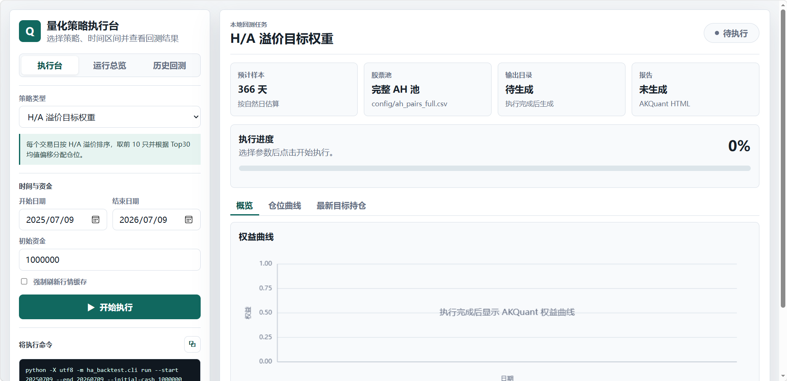
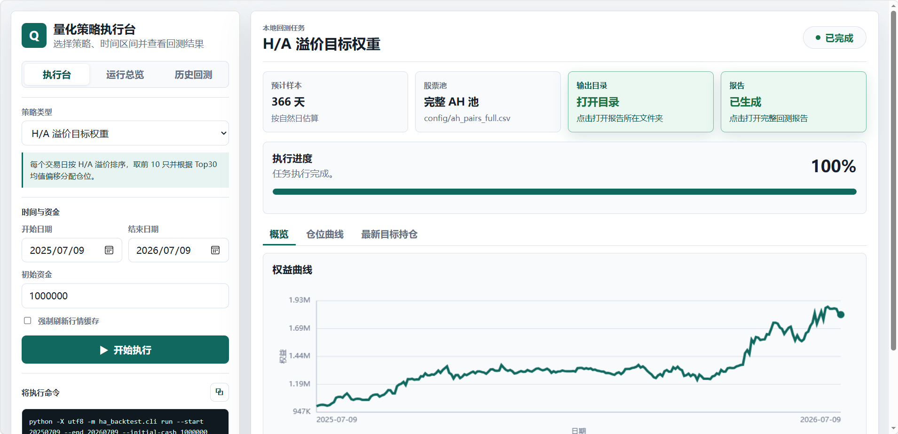
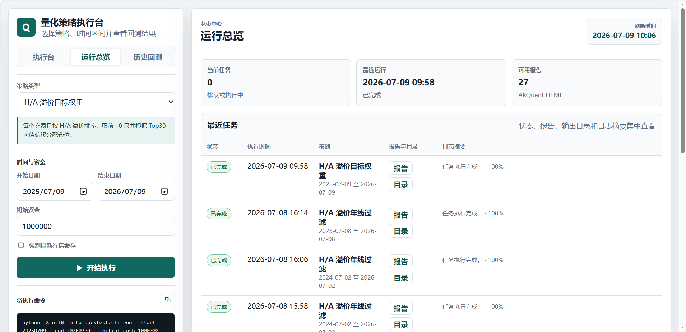
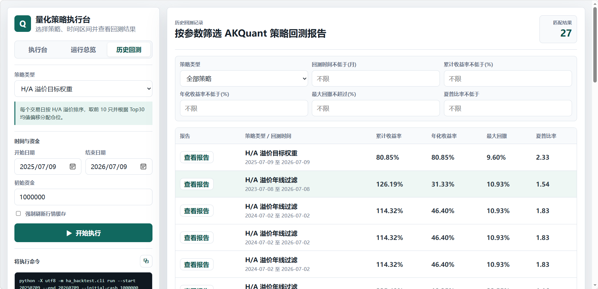
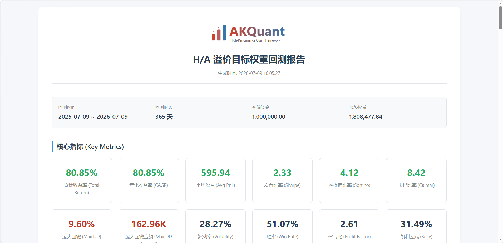

# AH Premium Lab

一个用于研究 AH 股 H/A 溢价策略的本地量化回测工具。

项目会通过 AKShare 获取 A 股行情、H 股行情和 HKD/CNY 汇率，逐日重算 H/A 溢价，生成目标仓位，并使用 AKQuant 运行回测。你可以通过命令行运行，也可以启动本地 Web UI 操作。

## 功能概览

- 完整 AH 配对池：默认读取 `config/ah_pairs_full.csv`
- 历史溢价重算：用 H 股收盘价、汇率和 A 股收盘价计算每日 H/A 溢价
- SQLite 本地缓存：默认缓存文件为 `data/cache/market_cache.sqlite`
- 两个内置策略：
  - `ha-premium`：按 H/A 溢价排序并根据 Top30 均值偏移分配仓位
  - `ha-premium-annual-line`：在基础策略上增加 A 股 250 日均线过滤
- 本地 Web UI：可在浏览器中提交回测、查看历史运行和结果摘要
- CLI 工具：可直接构建溢价数据、目标权重并运行回测

## Web UI 预览

下面是一组本地回测示例截图，展示从提交任务到查看历史报告的完整流程。

### 1. 执行台首页

执行台用于选择策略、设置回测区间和初始资金，并实时生成对应命令。默认示例使用完整 AH 池，回测区间为最近一年，初始资金为 `1,000,000`。



### 2. 策略执行完成

任务完成后，进度条变为 100%，页面会显示权益曲线，并提供打开输出目录和 AKQuant HTML 报告的入口。



### 3. 运行总览

运行总览集中展示当前任务、最近运行时间、可用报告数量和最近任务列表，适合确认回测是否完成以及快速打开报告或输出目录。



### 4. 历史回测

历史回测页会汇总已生成的 AKQuant 策略报告，并支持按策略、回测时长、累计收益率、年化收益率、最大回撤和夏普比率筛选。



示例结果中，`H/A 溢价目标权重` 在 `2025-07-09` 至 `2026-07-09` 区间内的报告摘要为：累计收益率 `80.85%`、年化收益率 `80.85%`、最大回撤 `9.60%`、夏普比率 `2.33`。这些数值只用于说明界面和输出格式，不构成投资建议。

### 5. AKQuant 报告示例

AKQuant HTML 报告会展示回测区间、初始资金、最终权益和关键指标，便于进一步查看策略表现。



示例报告已提交到仓库：[examples/akquant_ha_report.html](examples/akquant_ha_report.html)。该 HTML 已内嵌 Plotly 脚本和图表数据，不运行项目也能查看权益、回撤等曲线；如果想直接按网页渲染查看，可以打开：[AKQuant 报告在线预览](https://htmlpreview.github.io/?https://github.com/justhxd/ah-premium-lab/blob/main/examples/akquant_ha_report.html)。

## 运行条件

请先准备：

- Python 3.10 或更高版本
- pip
- 可访问 AKShare 数据源的网络环境
- Node.js：仅在运行完整校验脚本时需要，用于检查前端 JavaScript 语法
- Windows PowerShell：仅在使用 `start_web_ui.ps1`、`stop_web_ui.ps1`、`scripts/check.ps1` 这些便捷脚本时需要

核心 Python 依赖在 `pyproject.toml` 中声明：

- `akshare`
- `akquant`
- `pandas`
- `pytest`，仅开发和测试时需要

## 快速开始

克隆仓库后，在项目根目录安装依赖：

```powershell
python -m pip install -U pip setuptools wheel
python -m pip install -e ".[dev]"
```

如果不需要运行测试，也可以只安装运行依赖：

```powershell
python -m pip install -e .
```

建议在独立的 Python 环境中安装依赖，避免和系统里其他项目的包版本互相影响；环境名称不做要求。

## 启动 Web UI

Windows 下可以直接运行：

```powershell
.\start_web_ui.ps1
```

默认会启动到：

```text
http://127.0.0.1:8765/
```

停止服务：

```powershell
.\stop_web_ui.ps1
```

也可以不用脚本，直接启动 Python 模块：

```powershell
python -m ha_backtest.web --host 127.0.0.1 --port 8765
```

## 命令行用法

构建历史 H/A 溢价和目标权重：

```powershell
python -m ha_backtest.cli build-premium --start 20250101 --end 20260702
```

运行默认回测：

```powershell
python -m ha_backtest.cli run --start 20250101 --end 20260702 --initial-cash 1000000
```

运行年线过滤策略：

```powershell
python -m ha_backtest.cli run --strategy ha-premium-annual-line --start 20250101 --end 20260702 --initial-cash 1000000
```

常用参数：

- `--pairs`：AH 配对文件，默认 `config/ah_pairs_full.csv`
- `--start` / `--end`：回测区间，格式为 `YYYYMMDD`
- `--initial-cash`：初始资金
- `--output-dir`：输出根目录，默认 `data`
- `--refresh`：强制重新拉取本次区间数据并刷新缓存
- `--integer-percent`：使用整数百分比权重

## 输出文件

每次 CLI 回测会在 `data` 下创建独立目录，目录名类似：

```text
data/run_20250101_20260702_20260702_170512
```

主要输出包括：

- `akquant_ha_report.html`：AKQuant 回测报告
- `strategy_description.md`：本次策略说明和运行参数
- `ha_premium_history.csv`：本次使用的 H/A 溢价历史
- `target_weights.csv`：每日目标仓位
- `last_premium_snapshot.csv`：最后一个交易日的溢价快照
- `run_metadata.json`：通过 Web UI 运行时生成的历史记录元数据

## 策略逻辑

基础计算：

```text
H股人民币价格 = H股历史收盘价(HKD) * HKD/CNY
A股年线 = A股历史收盘价的 250 个交易日移动平均
H/A溢价率 = (H股人民币价格 / A股历史收盘价 - 1) * 100
```

每日调仓规则：

```text
按 H/A 溢价率从高到低排序
Top30均值 = 前30只股票 H/A溢价率的平均值
候选持仓 = 前10只股票对应的 A 股
偏移量 = 候选股票 H/A溢价率 - Top30均值
```

当候选股票偏移量总和不超过总仓位上限时：

```text
A股目标权重 = 偏移量 / 100
```

当偏移量总和超过总仓位上限时：

```text
A股目标权重 = 偏移量 / 偏移量总和 * 总仓位上限
```

`ha-premium-annual-line` 会额外要求候选 A 股收盘价高于 250 日均线。低于、等于或缺少年线数据的候选标的目标仓位为 0，仓位不会重新分配给其他股票。

默认总仓位上限为 100%。当偏移量总和不足 100% 时，剩余资金保留为现金。

## 数据与缓存

行情和汇率数据通过 AKShare 获取，并写入 SQLite 增量缓存：

```text
data/cache/market_cache.sqlite
```

再次请求相同或相邻区间时，程序会优先读取本地缓存，只向 AKShare 拉取缺失区间。使用 `--refresh` 可以强制重新拉取本次请求区间。

注意：`config/ah_pairs_full.csv` 来自当前可得 AH 配对列表。如果要做严格长期研究，需要额外评估历史上市、退市和幸存者偏差。

## 项目结构

```text
config/                 AH 配对文件
data/                   本地缓存和回测输出，通常不提交
scripts/check.ps1       一键校验脚本
src/ha_backtest/        Python 源码
src/ha_backtest/core/   回测、策略注册和输出汇总
src/ha_backtest/data.py 数据读取、缓存和溢价计算
src/ha_backtest/web.py  本地 Web API
src/ha_backtest/strategies/ha_premium/  H/A 溢价策略实现
tests/                  单元测试
ui/                     Web UI 静态文件
```

## 验证

完整校验：

```powershell
.\scripts\check.ps1
```

脚本会执行：

- Python 编译检查
- pytest 单元测试
- `node --check` 前端语法检查
- 临时启动本地 Web 服务并检查 `/api/strategies` 和 `/api/status`

如果没有安装 Node.js，或只想快速跑 Python 检查，可以先直接运行：

```powershell
python -m compileall -q src tests diagnose_backtest_run.py
python -m pytest
```

跳过 API smoke test：

```powershell
.\scripts\check.ps1 -SkipSmoke
```

## 常见问题

`Cannot find Python command`

确认 Python 已安装并能在当前终端中通过 `python --version` 运行。也可以给脚本传入解释器路径：

```powershell
.\scripts\check.ps1 -Python C:\Path\To\python.exe
```

`Cannot find node`

完整校验需要 Node.js 检查前端语法。只运行 Python 测试时不需要 Node.js。

AKShare 数据拉取失败

确认网络可访问数据源，稍后重试，或检查本地缓存是否已有所需区间。部分数据接口可能受交易日、网络或上游服务状态影响。

端口被占用

启动 Web UI 时换一个端口：

```powershell
.\start_web_ui.ps1 -Port 8766
```

或直接使用 Python 模块：

```powershell
python -m ha_backtest.web --host 127.0.0.1 --port 8766
```
